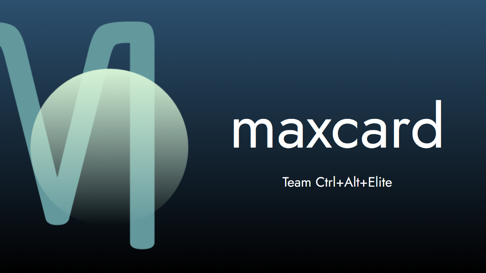
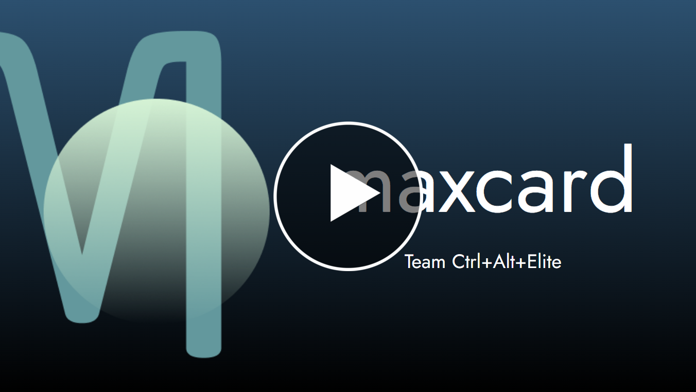

# MaxCard

A cross-platform mobile app that helps you maximize your cash back on-the-go.

This project was designed and developed as a capstone project for the University of Missouri's Computer Science program.

## Video Demo

## Usage

-   Sign in with Google account
-   Add credit cards to your Wallet
-   When out and about, open the app and instantly see which card to use for the best cash back
-   Profit!

## Technologies Used

-   AWS (Amazon Web Services)
    -   CodePipeline
    -   EC2
    -   Key Management Service
    -   DynamoDB
-   Flask
-   GCP (Google Cloud Platform)
    -   Google Maps API
    -   Sign In with Google
-   React Native
-   Expo Go

## Authors

-   [Olivia Guess](https://www.linkedin.com/in/olivia-guess/)
-   [Eli Bollinger](https://www.linkedin.com/in/elijah-bollinger/)
-   [Andrew Kim](https://www.linkedin.com/in/ahkim3/)
-   [Kai Chen](https://www.linkedin.com/in/kai-chen-191781235/)
-   [Tyler Harsell](https://www.linkedin.com/in/tyler-harsell/)
-   [Jackson Bowes](https://www.linkedin.com/in/jackson-bowes-b56a69200/)

## Project Management

### [Kanban Board](https://github.com/users/ahkim3/projects/4/views/1?query=is%3Aopen+sort%3Aupdated-desc)

### [Development Roadmap](https://github.com/users/ahkim3/projects/4/views/4?query=is%3Aopen+sort%3Aupdated-desc)
